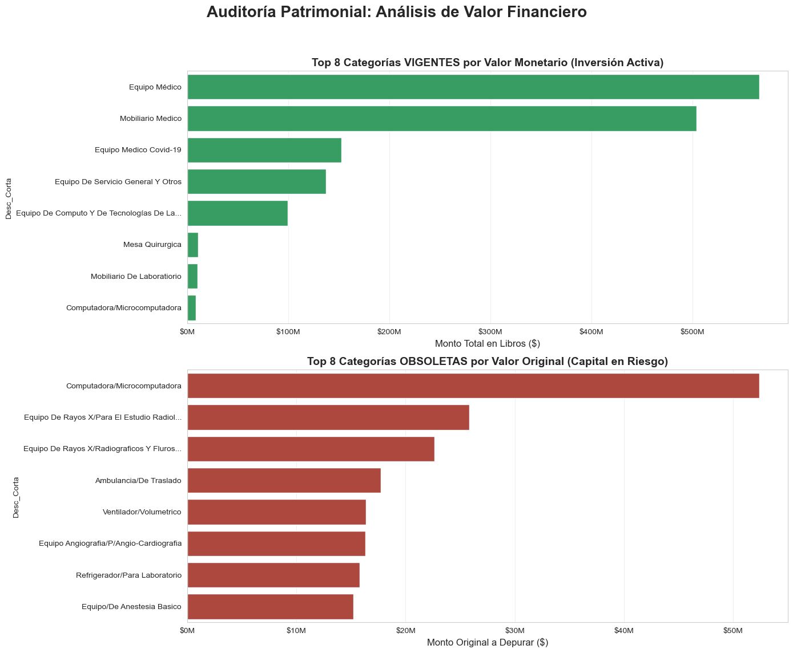

# Auditoría Patrimonial y Análisis de Riesgos Financieros

  

## 🔗 Acceso Rápido al Código
| **Ver Notebook Completo** |
| :---: |
|  |

---

## 📋 Descripción del Proyecto
Este proyecto consiste en una auditoría técnica y financiera aplicada a una base de datos patrimonial de gran volumen (aproximadamente 50,000 registros). 

El objetivo principal fue trascender el inventario físico tradicional para realizar un **análisis de obsolescencia normativa**, permitiendo cuantificar el valor real de los activos fijos y detectar el capital en riesgo por depreciación total.

## 🎯 Problema de Negocio
En la gestión de activos a gran escala, es común que los registros contables pierdan sincronía con la realidad operativa. Esto genera:
1.  **Incertidumbre Financiera:** Desconocimiento del valor neto en libros actual.
2.  **Riesgo Operativo:** Uso de equipos (especialmente tecnológicos y médicos) que han excedido su vida útil recomendada.
3.  **Ineficiencia Presupuestal:** Falta de evidencia basada en datos para justificar planes de renovación.

## ⚙️ Metodología Aplicada
Se implementó un flujo de trabajo en Python para procesar y auditar la información, sustituyendo el análisis manual por algoritmos lógicos:

1.  **Limpieza y Normalización (ETL):** Procesamiento de la columna *'Tipo'* para estandarizar categorías y eliminar valores nulos que sesgaban la información.
2.  **Reglas de Negocio Contables:** Asignación automática de vida útil basada en la tipología del bien (Cómputo: 3 años, Vehículos: 5 años, Mobiliario/Equipo Médico: 10 años).
3.  **Cálculo de Depreciación:** Determinación de la antigüedad exacta y el valor en libros remanente para cada activo.
4.  **Segmentación de Riesgo:** Clasificación del inventario en dos estados financieros:
    * **VIGENTE:** Activos con valor contable remanente.
    * **OBSOLETO (CRÍTICO):** Activos totalmente depreciados que requieren baja.

## 📊 Principales Hallazgos (Estadísticas Clave)

El análisis de la base de datos arrojó los siguientes resultados financieros:

* **Patrimonio Activo (Vigente):** Se validó un importe de **$1,615,091,762.79 MXN** en activos operativos, concentrados principalmente en Equipo Médico de alta gama.
* **Capital en Riesgo (Obsolescencia):** Se detectó un monto de **$671,519,523.99 MXN** correspondiente a bienes que han superado su vida útil normativa.
* **Foco de Atención:** El análisis por categorías revela que el rubro de *Computadoras y Microcomputadoras* representa una de las mayores concentraciones de obsolescencia tecnológica.

> **Indicador de Desempeño:** La auditoría revela un ratio de obsolescencia de **0.29**. Esto indica que, por cada peso registrado en el inventario histórico, 29 centavos corresponden a activos que financieramente ya no aportan valor en libros.

## 📉 Visualización de Datos

El siguiente tablero muestra la distribución financiera del inventario, contrastando los activos de mayor valor vigente contra las categorías con mayor rezago tecnológico.

## 🛠️ Herramientas Utilizadas
* **Lenguaje:** Python 3.12
* **Librerías de Análisis:** Pandas, NumPy (Cálculo vectorial).
* **Visualización:** Matplotlib, Seaborn (Gráficos estadísticos).
* **Entorno:** Visual Studio Code / Jupyter Notebooks.

---
**Autor:** Octavio Landa Verde
*Analista de Datos | Especialidad en Finanzas y Control Interno*
